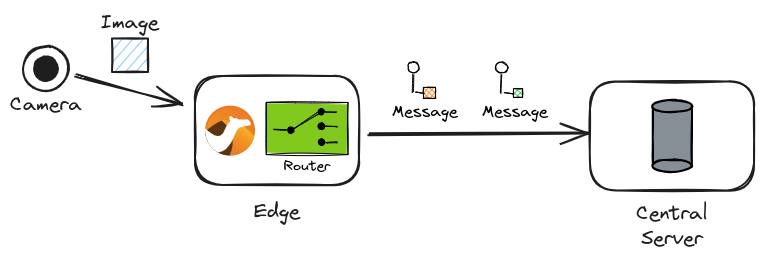

== Camel AI Example: Image to Text

*Requires: Apache Camel 4.8.0 or later*

=== Introduction

This example shows how Camel can consume images and route the messages based on the text output classified from the images.

Typical application scenarios include the use of image recognition from cameras in edge computing and the notification of the classification results to a central server.

.Image recognition and classification in edge computing

=== The example

What link:image_to_text.java[this example] does is as follows:

1. Read image files (jpg or png) from the `data/inbox` directory.
2. Feed them to the `ssd` DJL PyTorch model for object detection.
3. Convert the results from `DetectedObjects` to `Image[]`.
4. Split the images and feed each of them to the `resnet` DJL PyTorch model for image classification.
5. Look up the hypernym of each classification result with the WordNet database.
6. Output the result to the log.

=== Run

You can run this example from the project root using:

[source,console]
----
camel run image-to-text/image_to_text.java
----

Then put some image to the `data/inbox` directory:

[source,console]
----
cp doge.jpg data/inbox
----

And see the output in the console:

----
2024-07-25 16:41:47.103  INFO 1909048 --- [le://data/inbox] image_to_text.java:22 : Processing: doge.jpg
2024-07-25 16:41:48.521  INFO 1909048 --- [le://data/inbox] image_to_text.java:39 :   => [dingo, wild dog]
----

=== Export to a project

You can export this example to a project (for example Quarkus) using:

[source,console]
----
cd image-to-text
camel export --runtime quarkus --gav=org.apache.camel.example:image_to_text:1.0-SNAPSHOT image_to_text.java
----

=== Help and contributions

If you hit any problem using Camel or have some feedback, then please
https://camel.apache.org/community/support/[let us know].

We also love contributors, so
https://camel.apache.org/community/contributing/[get involved] :-)

The Camel riders!
