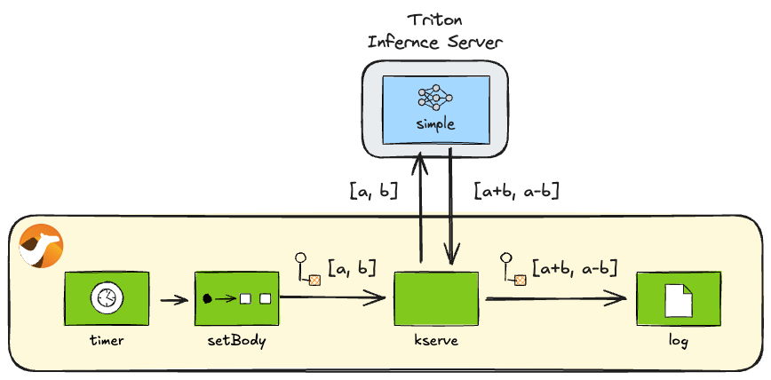

== Camel AI Examples: KServe

*Requires: Apache Camel 4.10.0 or later*

=== Introduction

This directory contains a collection of small examples for showing what the https://camel.apache.org/components/next/kserve-component.html[Camel KServe component]
can do.

=== Preparation

Before you run this set of examples, you need a running local model server that can talk https://kserve.github.io/website/latest/modelserving/data_plane/v2_protocol/[KServe Open Inference Protocol V2]. There are several model servers that can do so (OpenVINO, Triton, etc.). In this example, we use https://docs.nvidia.com/deeplearning/triton-inference-server/user-guide/docs/getting_started/quickstart.html[Triton Inference Server docker image], because it supports not only `amd64` but also `arm64` architectures so macOS users can try it easily.

From the root of this project, you can run the Docker image with the following command:

[source,console]
----
docker run --rm --name triton \
    -p 8000:8000 \
    -p 8001:8001 \
    -p 8002:8002 \
    -v ./kserve/models:/models \
    nvcr.io/nvidia/tritonserver:25.02-py3 \
    tritonserver --model-repository=/models
----

TIP: The Triton Inference Server docker image `nvcr.io/nvidia/tritonserver` is quite large (≈ 18.2 GB), so the initial image pull may take a while to complete.

Note that this command also mounts the link:models[`models`] directory to the container, which includes one model `simple` for demonstration purposes. The examples in this doc use this model. What this model does is explained in the <<Perform inference>> section.

=== The examples

This set of examples shows you how you can interact with a model server that supports KServe API using the Camel component.

==== Check server readiness

You can check the readiness of the model server with KServe API from a Camel route as follows:

[source,java]
.link:server_ready.java[]
----
from("timer:server-ready?repeatCount=1")
    .to("kserve:server/ready")
    .log("Ready: ${body.ready}");
----

To run this example, execute the following command from the project root:

[source,console]
----
camel run kserve/server_ready.java
----

You should get the following output in the console:

----
INFO 3977 --- [://server-ready] server_ready.java:14 : Ready: true
----

==== Check server liveness

You can check the liveness of the model server with KServe API from a Camel route as follows:

[source,java]
.link:server_live.java[]
----
from("timer:server-live?repeatCount=1")
    .to("kserve:server/live")
    .log("Live: ${body.live}");
----

To run this example, execute the following command from the project root:

[source,console]
----
camel run kserve/server_live.java
----

You should get the following output in the console:

----
INFO 22777 --- [r://server-live] server_live.java:14 : Live: true
----

==== Obtain server metadata

You can obtain the metadata of the model server with KServe API from a Camel route as follows:

[source,java]
.link:server_metadata.java[]
----
from("timer:server-metadata?repeatCount=1")
    .to("kserve:server/metadata")
    .log("Metadata:\n${body}");
----

To run this example, execute the following command from the project root:

[source,console]
----
camel run kserve/server_metadata.java
----

You should get the output like the following in the console:

----
INFO 26512 --- [server-metadata] server_metadata.java:14 : Metadata:
name: "triton"
version: "2.55.0"
extensions: "classification"
extensions: "sequence"
extensions: "model_repository"
extensions: "model_repository(unload_dependents)"
extensions: "schedule_policy"
extensions: "model_configuration"
extensions: "system_shared_memory"
extensions: "cuda_shared_memory"
extensions: "binary_tensor_data"
extensions: "parameters"
extensions: "statistics"
extensions: "trace"
extensions: "logging"
----

==== Check model readiness

You can check the readiness of a model by specifying the model name (and optionally the version):

[source,java]
.link:model_ready.java[]
----
from("timer:model-ready?repeatCount=1")
    .to("kserve:model/ready?modelName=simple&modelVersion=1")
    .log("Ready: ${body.ready}");
----

To run this example, execute the following command from the project root:

[source,console]
----
camel run kserve/model_ready.java
----

You should get the following output in the console:

----
INFO 28715 --- [r://model-ready] model_ready.java:14 : Ready: true
----

==== Obtain model metadata

When working with an inference model, it is important to first understand the metadata of the model. This is because you need to know the label names and data types of the inputs and outputs to call the model.

[source,java]
.link:model_metadata.java[]
----
from("timer:model-metadata?repeatCount=1")
    .to("kserve:model/metadata?modelName=simple&modelVersion=1")
    .log("Metadata:\n${body}");
----

To run this example, execute the following command from the project root:

[source,console]
----
camel run kserve/model_metadata.java
----

You should get the following output in the console:

----
INFO 33846 --- [/model-metadata] model_metadata.java:14 : Metadata:
name: "simple"
versions: "1"
platform: "tensorflow_graphdef"
inputs {
  name: "INPUT0"
  datatype: "INT32"
  shape: -1
  shape: 16
}
inputs {
  name: "INPUT1"
  datatype: "INT32"
  shape: -1
  shape: 16
}
outputs {
  name: "OUTPUT0"
  datatype: "INT32"
  shape: -1
  shape: 16
}
outputs {
  name: "OUTPUT1"
  datatype: "INT32"
  shape: -1
  shape: 16
}
----

==== Perform inference

Once you know the metadata of the model, you can run predictions on the model. Let's invoke the `simple` model to run a very simple prediction.

As you confirmed in the <<Obtain model metadata>> section, the `simple` model takes two `INT32` lists of size 16 as the inputs, `INPUT0` and `INPUT1`, and returns two `INT32` lists of size 16 as the outputs, `OUTPUT0` and `OUTPUT1`. The model simply returns the result of adding each element of `INPUT0` and `INPUT1` as `OUTPUT0` and subtracting each element of `INPUT0` and `INPUT1` as `OUTPUT1`.

.Invoking the simple model

In this example, the following inputs and outputs are given to and obtained from the model:

----
INPUT0  = [1,  2,  3,  4,  5,  6,  7,  8,  9, 10, 11, 12, 13, 14, 15, 16]
INPUT1  = [0,  1,  2,  3,  4,  5,  6,  7,  8,  9, 10, 11, 12, 13, 14, 15]
OUTPUT0 = [1,  3,  5,  7,  9, 11, 13, 15, 17, 19, 21, 23, 25, 27, 29, 31]
OUTPUT1 = [1,  1,  1,  1,  1,  1,  1,  1,  1,  1,  1,  1,  1,  1,  1,  1]
----

[source,java]
.link:infer_simple.java[]
----
public void configure() throws Exception {
    from("timer:infer-simple?repeatCount=1")
        .setBody(constant(createRequest()))
        .to("kserve:infer?modelName=simple&modelVersion=1")
        .process(this::postprocess)
        .log("Result[0]: ${body[0]}")
        .log("Result[1]: ${body[1]}");
}

ModelInferRequest createRequest() {
    var ints0 = IntStream.range(1, 17).boxed().collect(Collectors.toList());
    var content0 = InferTensorContents.newBuilder().addAllIntContents(ints0);
    var input0 = ModelInferRequest.InferInputTensor.newBuilder()
            .setName("INPUT0").setDatatype("INT32").addShape(1).addShape(16)
            .setContents(content0);
    var ints1 = IntStream.range(0, 16).boxed().collect(Collectors.toList());
    var content1 = InferTensorContents.newBuilder().addAllIntContents(ints1);
    var input1 = ModelInferRequest.InferInputTensor.newBuilder()
            .setName("INPUT1").setDatatype("INT32").addShape(1).addShape(16)
            .setContents(content1);
    return ModelInferRequest.newBuilder()
            .addInputs(0, input0).addInputs(1, input1)
            .build();
}

void postprocess(Exchange exchange) {
    var response = exchange.getMessage().getBody(ModelInferResponse.class);
    var outList = response.getRawOutputContentsList().stream()
            .map(ByteString::asReadOnlyByteBuffer)
            .map(buf -> buf.order(ByteOrder.LITTLE_ENDIAN).asIntBuffer())
            .map(buf -> {
                var ints = new ArrayList<Integer>(buf.remaining());
                while (buf.hasRemaining()) {
                    ints.add(buf.get());
                }
                return ints;
            })
            .collect(Collectors.toList());
    exchange.getMessage().setBody(outList);
}
----

To run this example, execute the following command from the project root:

[source,console]
----
camel run kserve/infer_simple.java
----

You should get the following output in the console:

----
INFO 70313 --- [://infer-simple] infer_simple.java:28 : Result[0]: [1, 3, 5, 7, 9, 11, 13, 15, 17, 19, 21, 23, 25, 27, 29, 31]
INFO 70313 --- [://infer-simple] infer_simple.java:29 : Result[1]: [1, 1, 1, 1, 1, 1, 1, 1, 1, 1, 1, 1, 1, 1, 1, 1]
----

=== Export to a project

You can export these examples to a project (for example Quarkus) using:

[source,console]
----
cd kserve
camel export --runtime quarkus --gav=org.apache.camel.example:kserve:1.0-SNAPSHOT infer_simple.java
----

=== Help and contributions

If you hit any problem using Camel or have some feedback, then please
https://camel.apache.org/community/support/[let us know].

We also love contributors, so
https://camel.apache.org/community/contributing/[get involved] :-)

The Camel riders!
