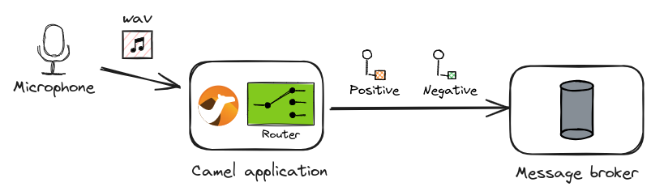

== Camel AI Example: Speech to Text

*Requires: Apache Camel 4.8.0 or later*

=== Introduction

This example shows how Camel can translate audio speech data to text and then apply sentiment analysis to it for routing the messages further.

One application of the example is a system that feeds the speech stream data from the microphone input into a Camel application, which then converts it into text data, performs sentiment analysis on the text and notifies the appropriate destinations based on the positive or negative results.

.Speech recognition and sentiment analysis

=== The example

What link:speech_to_text.java[this example] does is as follows:

1. Read audio files (`.wav`) from the `data/inbox` directory.
2. Feed them to a custom `wav2vec2` DJL PyTorch model for speech recognition.
3. Apply the resulted text to the `distilbert` DJL PyTorch model for sentiment analysis (classified as either `positive` or `negative`).
4. Output the result to the log (or route the message to a destination based on the sentiment result for a real scenario).

=== Run

You can run this example from the project root using:

[source,console]
----
camel run speech-to-text/speech_to_text.java
----

The requirement of the input wav files is 16kHz, 16bit, mono. Put some wav files that satisfy the requirement to the `data/inbox` directory using:

[source,console]
----
cp data/speech/speech1.wav data/inbox
cp data/speech/speech2.wav data/inbox
cp data/speech/speech3.wav data/inbox
----

And see the output in the console:

----
2024-07-30 17:10:03.955  INFO 3351853 --- [le://data/inbox] speech_to_text.java:26 : Processing: speech1.wav
2024-07-30 17:10:04.221  INFO 3351853 --- [le://data/inbox] speech_to_text.java:31 :   => oh grreat many things so
2024-07-30 17:10:04.338  INFO 3351853 --- [le://data/inbox] speech_to_text.java:33 :   => {"class": "Positive", "probability": 0.87968}
2024-07-30 17:10:17.924  INFO 3351853 --- [le://data/inbox] speech_to_text.java:26 : Processing: speech2.wav
2024-07-30 17:10:18.590  INFO 3351853 --- [le://data/inbox] speech_to_text.java:31 :   => dan this is not acceptable i've not even been notified about this automatic change
2024-07-30 17:10:18.718  INFO 3351853 --- [le://data/inbox] speech_to_text.java:33 :   => {"class": "Negative", "probability": 0.99945}
2024-07-30 17:10:28.792  INFO 3351853 --- [le://data/inbox] speech_to_text.java:26 : Processing: speech3.wav
2024-07-30 17:10:29.291  INFO 3351853 --- [le://data/inbox] speech_to_text.java:31 :   => many thanks that's so helpful i'm a bit more relieved now
2024-07-30 17:10:29.391  INFO 3351853 --- [le://data/inbox] speech_to_text.java:33 :   => {"class": "Positive", "probability": 0.97949}
----

=== Export to a project

You can export this example to a project (for example Quarkus) using:

[source,console]
----
cd speech-to-text
camel export --runtime quarkus --gav=org.apache.camel.example:speech_to_text:1.0-SNAPSHOT speech_to_text.java
----

=== Help and contributions

If you hit any problem using Camel or have some feedback, then please
https://camel.apache.org/community/support/[let us know].

We also love contributors, so
https://camel.apache.org/community/contributing/[get involved] :-)

The Camel riders!
